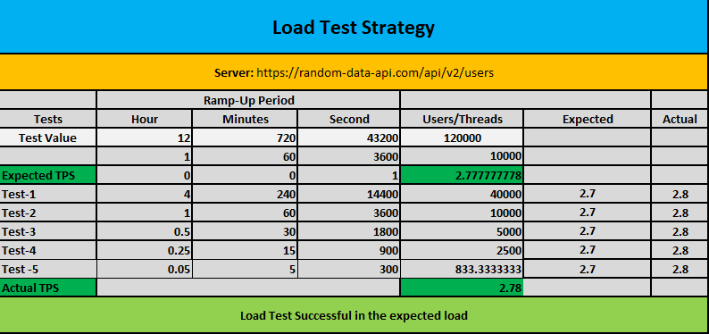

# Random-User-API-Performance-Test
This repository contains the practise work of performance test with Jmeter
---

### Tasks
Scenario: Find out the actual TPS for if 120000 users can give load for 12 hours
Perform load test on this URL: https://random-data-api.com/api/v2/users
1. You have to find out if the expected TPS (Transaction Per/Second) meet the above requirement.
Breakdown the expected TPS in excel sheet and find out the actual TPS (10)

2. Create another excel sheet where you will try to find out the bottleneck/stress test point. (At which point the system starts to show 1% error) (10)

### Prerequisites
- Jmeter

### Load Test and TPS Breakdwon

### Stress test point

